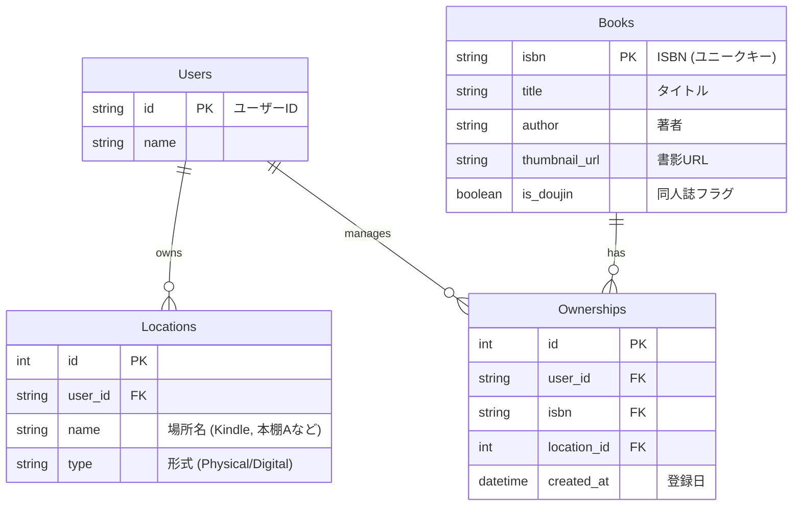

# 📘 書籍管理プロダクト 要件定義書 (MVP)

## 1. プロダクト概要

### 1.1 ビジョン

**「すべての本の『所有』と『アクセス手段』を一元管理する」**
商業誌から同人誌まで、自分が持っている本を網羅的に管理し、重複購入を防ぎつつ、読みたい時に「物理本棚にあるのか、電子書籍（Kindle等）にあるのか」を即座に把握できる状態を作る。

### 1.2 解決する課題 (Pain Points)

* **重複購入:** 気になった本が、既に持っている本なのか、未購入なのか忘れてしまう。
* **所在不明:** 「持っているはずだが、物理本で買ったか電子で買ったか」を忘れてしまい、探す手間が発生する。
* **管理の漏れ:** 既存サービス（読書メーター等）では、ISBNのない同人誌や古い技術書が管理できない。

### 1.3 ターゲット

* **フェーズ1 (今回):** 自分専用（個人利用）。
* **フェーズ2 (将来):** 一般ユーザー向けの蔵書管理・共有SNS。
* ※将来のマルチユーザー化を見据え、拡張性のあるデータ構造を採用する。


---

## 2. 機能要件 (Functional Requirements)

MVP（Minimum Viable Product）として実装する機能一覧です。

### 2.1 本の登録機能

ユーザーが本をデータベースに追加するフロー（以下の3手段を提供する）。

1. **キーワード検索登録 (API連携)**
* タイトルや著者名を入力し、Google Books API 等から候補を表示・選択して登録する。


2. **バーコードスキャン登録**
* スマホカメラで書籍のISBNバーコードを読み取り、情報を取得して登録する。


3. **簡易手動登録 (同人誌対応)**
* APIやバーコードでヒットしない本（同人誌・技術書）用。
* 最低限「タイトル」のみの手入力で登録可能とする（画像やURLは将来対応）。


### 2.2 所有・場所情報の管理

**「1つの作品」に対して「複数の場所」**を紐付けることができる。

* **場所マスタ管理:**
* ユーザー自身が「場所」を自由に定義・編集できる（CRUD）。
* *例: 「自宅本棚」「会社」「Kindle」「BOOTH」「O'Reilly Learning」*


* **所持登録:**
* 本を登録する際、上記のマスタから「どこにあるか」を選択する。
* *ユースケース: 『React入門』を「自宅本棚」と「Kindle」の両方で登録する。*


### 2.3 閲覧・検索機能

* 登録した本の一覧表示。
* ローカルデータ（登録済み書籍）からのキーワード検索。
* *「持っているか確認する」ための検索を最速で行えるようにする。*


---

## 3. データモデル (Data Model Concept)

将来のマルチユーザー化に対応するため、`user_id` を意識したリレーショナルな構造とします。



* **Books:** 書籍そのもののメタデータ。全ユーザーで共有可能なマスタデータ。
* **Locations:** ユーザーごとの「置き場所」定義。
* **Ownerships:** 「誰が」「どの本を」「どこに」持っているかの中間テーブル。

---

## 4. 技術スタック (Tech Stack)

**「低コスト・高パフォーマンス・スケーラビリティ」**を重視し、Cloudflareエコシステムを活用する。

| カテゴリ | 技術選定 | 選定理由 |
| --- | --- | --- |
| **Frontend** | **React (Vite)** | SPA構成。高速な動作と将来のPWA化の容易さ。 |
| **Backend** | **Hono** | Cloudflare Workersで動作する超軽量フレームワーク。起動が爆速。 |
| **Database** | **Cloudflare D1** | エッジで動作するSQLite。リレーショナルデータの結合に最適かつ安価。 |
| **Infra** | **Cloudflare Pages** | フロントエンドのホスティングとバックエンド(Functions)の一体運用。 |
| **Language** | **TypeScript** | Frontend/Backend共に型安全性を確保し、開発効率を向上。 |

### アーキテクチャ構成図

```mermaid
graph LR
    subgraph Client
        Browser[Mobile Browser / PWA]
    end

    subgraph Cloudflare_Ecosystem
        Pages[Cloudflare Pages]
        Workers[Hono (Workers API)]
        D1[(D1 Database)]
    end

    External[Google Books API]

    Browser -- HTTPS --> Pages
    Pages -- Hosting --> Browser
    Browser -- API Fetch --> Workers
    Workers -- SQL Query --> D1
    Workers -- Search Info --> External

```

---

## 5. ロードマップ (Roadmap)

### Phase 1: MVP (今回の開発範囲)

* 自分専用（シングルユーザー想定だがDBはマルチ対応で作る）。
* 検索/バーコード/手動による書籍登録。
* 場所マスタのCRUD。
* 所有情報の紐付けと表示。

### Phase 2: 機能拡張

* **書籍詳細の拡充:** 手動登録時の書影アップロード、購入URL管理。
* **ステータス管理:** 「積読」「読了」などのステータス付与。

### Phase 3: ソーシャル化

* **認証機能:** 一般ユーザーのサインアップ機能。
* **公開機能:** 自分の本棚をURLでシェアする機能。
* **レビュー:** 感想や評価の投稿・共有。

---

### 次のステップ (Next Step)

この要件定義書に基づき、**「Cloudflare D1 のテーブル作成（SQLスキーマ設計）」** から開発着手します。