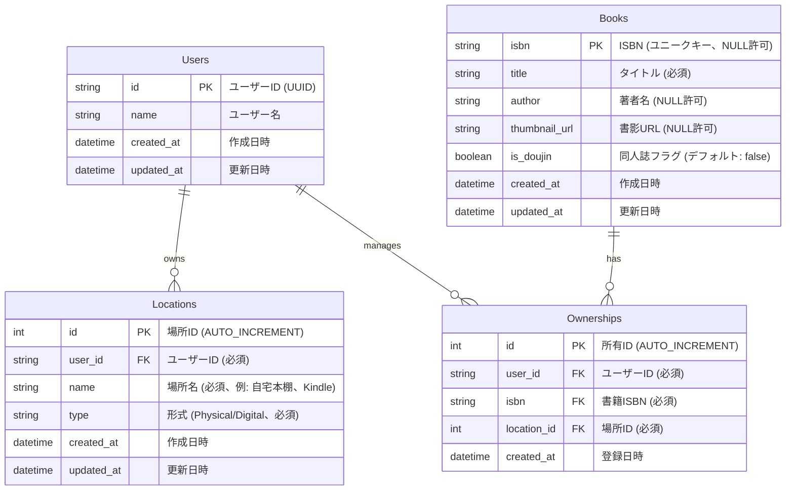

# Data Model: 書籍管理プロダクト MVP

**Created**: 2025-12-22  
**Purpose**: データベーススキーマとエンティティ関係の定義

## Entity Relationship Diagram



## Entity Definitions

### Users

将来のマルチユーザー対応を見据えたユーザーテーブル。MVPフェーズでは1ユーザーのみ使用。

**Fields**:
- `id` (string, PK): ユーザーID。UUID形式。将来の認証システムと統合可能。
- `name` (string): ユーザー名。表示用。
- `created_at` (datetime): アカウント作成日時。
- `updated_at` (datetime): 最終更新日時。

**Validation Rules**:
- `id`: 必須、UUID形式
- `name`: 必須、最大255文字

**State Transitions**: N/A（シンプルなCRUD）

### Books

書籍マスタデータ。全ユーザーで共有可能。ISBNがユニークキーだが、同人誌などISBNがない場合はNULLを許可。

**Fields**:
- `isbn` (string, PK): ISBN。ユニークキー。NULL許可（同人誌対応）。
- `title` (string): タイトル。必須。
- `author` (string): 著者名。NULL許可。
- `thumbnail_url` (string): 書影画像のURL。NULL許可。
- `is_doujin` (boolean): 同人誌フラグ。デフォルト: false。
- `created_at` (datetime): 登録日時。
- `updated_at` (datetime): 最終更新日時。

**Validation Rules**:
- `isbn`: NULL許可、ISBN形式の場合は有効なISBNを検証
- `title`: 必須、最大500文字
- `author`: NULL許可、最大255文字
- `thumbnail_url`: NULL許可、有効なURL形式
- `is_doujin`: デフォルト false

**State Transitions**: N/A（シンプルなCRUD）

**Indexes**:
- `isbn`: ユニークインデックス（NULL値は除外）
- `title`: 検索用インデックス
- `author`: 検索用インデックス

### Locations

ユーザーが定義する「置き場所」マスタ。各ユーザーが独自の場所を定義可能。

**Fields**:
- `id` (int, PK): 場所ID。AUTO_INCREMENT。
- `user_id` (string, FK): ユーザーID。Usersテーブルへの外部キー。
- `name` (string): 場所名。例: "自宅本棚", "Kindle", "BOOTH"。
- `type` (string): 形式。'Physical' または 'Digital'。
- `created_at` (datetime): 作成日時。
- `updated_at` (datetime): 最終更新日時。

**Validation Rules**:
- `user_id`: 必須、Usersテーブルに存在する必要がある
- `name`: 必須、最大100文字、ユーザー内で一意
- `type`: 必須、'Physical' または 'Digital' のみ許可

**State Transitions**: N/A（シンプルなCRUD）

**Indexes**:
- `user_id`: ユーザー別の場所取得用
- `(user_id, name)`: ユーザー内での名前の一意性確保

### Ownerships

ユーザー、書籍、場所の関係を表す中間テーブル。1つの書籍に対して複数の場所を紐付け可能。

**Fields**:
- `id` (int, PK): 所有ID。AUTO_INCREMENT。
- `user_id` (string, FK): ユーザーID。Usersテーブルへの外部キー。
- `isbn` (string, FK): 書籍ISBN。Booksテーブルへの外部キー。
- `location_id` (int, FK): 場所ID。Locationsテーブルへの外部キー。
- `created_at` (datetime): 登録日時。

**Validation Rules**:
- `user_id`: 必須、Usersテーブルに存在する必要がある
- `isbn`: 必須、Booksテーブルに存在する必要がある
- `location_id`: 必須、Locationsテーブルに存在し、同じuser_idである必要がある
- `(user_id, isbn, location_id)`: ユニーク制約（同じユーザーが同じ書籍を同じ場所に重複登録できない）

**State Transitions**: N/A（シンプルなCRUD）

**Indexes**:
- `user_id`: ユーザー別の所有書籍取得用
- `isbn`: 書籍別の所有ユーザー取得用
- `location_id`: 場所別の所有書籍取得用
- `(user_id, isbn, location_id)`: ユニークインデックス

## Database Schema (SQL)

```sql
-- Users table
CREATE TABLE users (
    id TEXT PRIMARY KEY,
    name TEXT NOT NULL,
    created_at DATETIME DEFAULT CURRENT_TIMESTAMP,
    updated_at DATETIME DEFAULT CURRENT_TIMESTAMP
);

-- Books table
CREATE TABLE books (
    isbn TEXT PRIMARY KEY,  -- NULL許可はSQLiteの制約により別途処理が必要
    title TEXT NOT NULL,
    author TEXT,
    thumbnail_url TEXT,
    is_doujin INTEGER DEFAULT 0,  -- 0 = false, 1 = true
    created_at DATETIME DEFAULT CURRENT_TIMESTAMP,
    updated_at DATETIME DEFAULT CURRENT_TIMESTAMP
);

-- Locations table
CREATE TABLE locations (
    id INTEGER PRIMARY KEY AUTOINCREMENT,
    user_id TEXT NOT NULL,
    name TEXT NOT NULL,
    type TEXT NOT NULL CHECK(type IN ('Physical', 'Digital')),
    created_at DATETIME DEFAULT CURRENT_TIMESTAMP,
    updated_at DATETIME DEFAULT CURRENT_TIMESTAMP,
    FOREIGN KEY (user_id) REFERENCES users(id) ON DELETE CASCADE,
    UNIQUE(user_id, name)
);

-- Ownerships table
CREATE TABLE ownerships (
    id INTEGER PRIMARY KEY AUTOINCREMENT,
    user_id TEXT NOT NULL,
    isbn TEXT NOT NULL,
    location_id INTEGER NOT NULL,
    created_at DATETIME DEFAULT CURRENT_TIMESTAMP,
    FOREIGN KEY (user_id) REFERENCES users(id) ON DELETE CASCADE,
    FOREIGN KEY (isbn) REFERENCES books(isbn) ON DELETE CASCADE,
    FOREIGN KEY (location_id) REFERENCES locations(id) ON DELETE CASCADE,
    UNIQUE(user_id, isbn, location_id)
);

-- Indexes for performance
CREATE INDEX idx_books_title ON books(title);
CREATE INDEX idx_books_author ON books(author);
CREATE INDEX idx_locations_user_id ON locations(user_id);
CREATE INDEX idx_ownerships_user_id ON ownerships(user_id);
CREATE INDEX idx_ownerships_isbn ON ownerships(isbn);
CREATE INDEX idx_ownerships_location_id ON ownerships(location_id);
```

**Note**: SQLiteではNULLを主キーにできないため、ISBNがNULLの書籍（同人誌）については、別のID生成戦略が必要。実装では以下のいずれかを使用：
1. UUIDを生成してisbnカラムに格納（ISBNがない場合）
2. 別のIDカラムを追加（isbnをNULL許可のユニークキーから通常カラムに変更）

推奨: オプション1（UUID生成）を採用し、ISBNがある場合はISBNを、ない場合はUUIDを使用。

## Data Relationships

### One-to-Many Relationships

- **Users → Locations**: 1ユーザーが複数の場所を所有
- **Users → Ownerships**: 1ユーザーが複数の所有記録を持つ
- **Books → Ownerships**: 1書籍が複数の所有記録を持つ（複数ユーザー、複数場所）
- **Locations → Ownerships**: 1場所が複数の所有記録を持つ

### Many-to-Many Relationships

- **Users ↔ Books** (via Ownerships): ユーザーは複数の書籍を所有し、書籍は複数のユーザーに所有される（将来のマルチユーザー対応）
- **Books ↔ Locations** (via Ownerships): 書籍は複数の場所に存在し、場所は複数の書籍を含む

## Data Validation Rules

### Application-Level Validation

1. **ISBN Validation**: 
   - ISBN-10またはISBN-13形式を検証
   - ISBNがない場合はUUIDを生成

2. **Location Type Validation**: 
   - 'Physical' または 'Digital' のみ許可
   - 大文字小文字を区別

3. **Ownership Uniqueness**: 
   - 同じユーザーが同じ書籍を同じ場所に重複登録できない
   - データベース制約で強制

4. **Location Ownership**: 
   - 所有情報のlocation_idは、同じuser_idのLocationsレコードのみ参照可能
   - アプリケーションレベルで検証

## MVP Phase Considerations

### Single User Mode

- MVPフェーズでは1ユーザーのみ使用
- デフォルトユーザーIDを固定値（例: "default-user"）として使用
- 将来の認証システム導入時にスムーズに移行可能な設計

### Data Migration Strategy

- 将来のマルチユーザー対応時、既存データにuser_idを付与
- デフォルトユーザーのデータをそのまま移行可能

## Performance Considerations

### Query Optimization

- 頻繁に検索されるカラム（title, author）にインデックス
- 結合クエリの最適化（user_idベースのフィルタリング）
- ページネーション対応（大量データ時のパフォーマンス確保）

### Caching Strategy

- 書籍マスタデータ（Books）は変更頻度が低いためキャッシュ可能
- 場所マスタ（Locations）はユーザー別にキャッシュ
- 所有情報（Ownerships）は更新頻度に応じてキャッシュ戦略を検討

